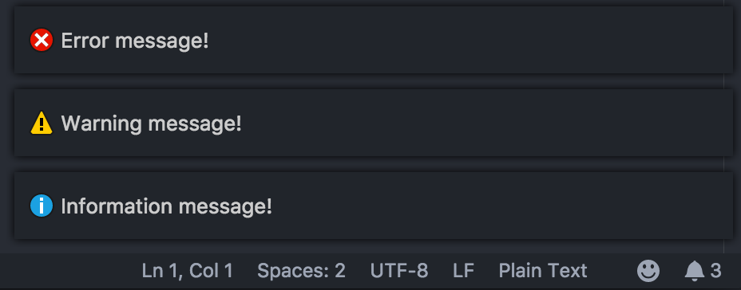

# Notification Tester

This extension triggers VS Code notifications. This is usable if you want to test Notification Center. I created this extension to prepare new coloring for theme which helps me to see how Notification Center looks like in different messages (info/warn/error).

## Usage

1.  Open Command Palette.
2.  Write `Notification Tester:` and use any command from the list to test Notification Center.

